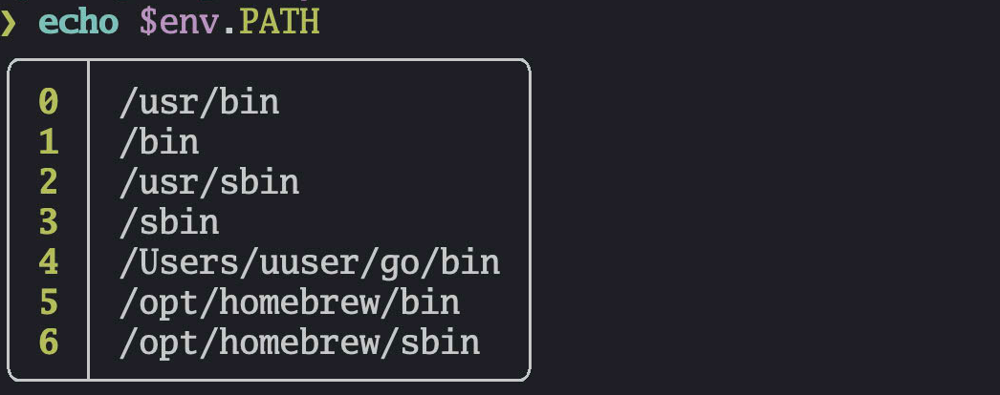

title:: cyber-prophet extra 1: installing mac from 0

- Software installation
	- https://brew.sh/
	  collapsed:: true
		- ```/bin/bash -c "$(curl -fsSL https://raw.githubusercontent.com/Homebrew/install/HEAD/install.sh)"
		  ```
		- 
		- Check that brew installed with `brew help` command
	- Go compiler
		- `brew install go`
	- Git
		- `brew install git`
	- Visual Studio Code
		- `brew install --cask visual-studio-code`
- Building cyber
	- Creating new directory
		- `mkdir gitfolder`
		- `cd gitfolder`
	- Clonning repository
		- `git clone https://github.com/cybercongress/go-cyber.git`
		- `cd go-cyber`
		- `make install`
	- Checking if cyber is installed correctly
		- `cyber version`
	- So we found that we need to add `~/go/bin` path to $PATH variable
		- `pwd`
		- `export PATH=$PATH:/Users/uuser/go/bin`
			- ```
			  > cyber version
			  0.3.2
			  ```
- Installing nushell
	- `brew install nushell`
- Launching nu
	- `nu`
- Installing Alacritty terminal
	- `brew install --cask alacritty`
	- To open the application 'Alacritty' for the first time - click on it's icon with right click and choose the 'open' button
		-
- Configurate Alacritty
	- to use nushell as default shell
	- to change the size of fonts
- In Alacritty in `.alacritty.yml`:
	- line 26
		- `window:`
	- line 81
		- `startup_mode: Maximized`
	- line 111
		- `font:`
	- line 159
		- `size: 18.0`
	- line 436 - To make nushell default shell for Alacritty
		- ```
		  shell:
		   program: /opt/homebrew/bin/nu
		   args:
		     - --login
		  ```
		-
- Configuring nu in Alacritty to enable open nushell:
	- adding go executable folder into $PATH variable
		- `let-env PATH = ( $env.PATH | append /Users/uuser/go/bin )`
	- check if cyber works
		- cyber version
	- Add this command into config of nu
		- `config nu`
		- add into the last line
		- `let-env PATH = ( $env.PATH | append /Users/uuser/go/bin )`
	- Modify this command to add Brew folders into $PATH variable to. Beware of the name of your user. In the video it is 'uuser', but in your case it is likely to be diffrent
		- ```
		  let-env PATH = ( $env.PATH | append [
		  /Users/uuser/go/bin  
		  /opt/homebrew/bin  
		  /opt/homebrew/sbin] )
		  ```
	- check if your $PATH variable looks correctly
		- `echo $env.PATH`
		- 
- Install Starship to make our promt look beautiful
	- 
	- `brew install starship`
	- `mkdir ~/.cache/starship`
	- `starship init nu | save ~/.cache/starship/init.nu`
- Install NERD font for Starship
	- `brew tap homebrew/cask-fonts`
	- `brew install --cask font-go-mono-nerd-font`
	- In Alacritty in `.alacritty.yml`:
		- line 120
			- `family: GoMono Nerd Font Mono`
- Install pussy
	- `git clone https://github.com/joinresistance/space-pussy.git`
	- `cd space-pussy`
	- `make install`
	- Check if it works
		- `pussy version`
- Install IPFS
	- `brew install ipfs`
	-